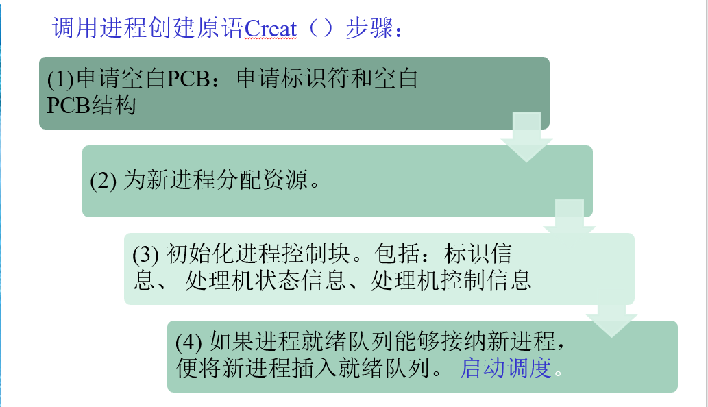
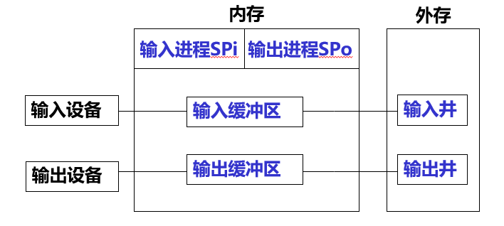
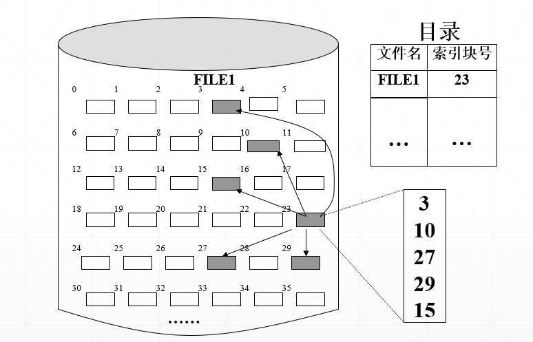

# 操作系统笔记整理
[TOC]
# 第一章 引论 
## 1. OS的定义与作用
#### 1.1 OS的定义
操作系统是一组控制和管理计算机软硬件资源、合理地对各类作业进行调度以及方便用户使用的程序集合。
#### 1.2 OS的作用
1. 作为用户与计算机硬件之间的接口
2. 作为计算机系统资源的管理者（软硬件资源）
具体内容：  
         <u>1. 处理机管理，用于分配和控制处理机；  
            2. 存储器管理，主要负责内存的分配与回收；  
            3. I/O设备管理，负责I/O设备的分配与操纵；  
            4. 文件管理，负责文件的存取、共享和保护。</u>  

3. 用作扩充机器功能，使其便于使用
***
## 2. 三种基本操作系统的基本原理和异同
     注意：多道程序设计、时间片轮转法、及时性 
三种基本操作系统分别为：<u>多道批处理系统，分时系统，实时系统</u>  
|   | 多道批处理系统 | 分时系统 | 实时系统 |
|----|----|----|----|
|基本原理|在内存中存放多道作业运行，运行结束或出错，自动调度内存中的另一道作业运行。|分类：<br>1. 简单分时系统；<br>2. 具有“前台”和“后台”的分时系统；<br>3. 多道分时系统；<br> **对cpu时间进行分片，操作系统把时间片轮流地分给各个并发程序。**|无 |
|主要特征|**多道性、无序性、调度性（进程调度和作业调度）。**<br>优点：提高了资源利用率和吞吐能力<br>缺点：平均周转时间长，没有交互能力|多路性：一个主机与多个终端相连；<br>独立性：彼此独立操作，互不干扰；<br>及时性：系统能在很短的时间得到回答；<br>交互性：能实现人机对话（区别于批处理系统）；|**1、多路性：能对多个对象进行控制。<br>2、独立性：独立运行，不混淆，不破坏。<br>3、交互性：仅限于访问系统中某些特定的专用服务程序。<br>4、可靠性：高可靠性，应具有多级容错防护能力。<br>5、及时性：不同的系统要求不一样，控制对象必须在截止时间内完成。<br>**<br>实时任务的类型：<br>1.按任务执行是否为周期性来化分:周期性实时任务,非周期性实时任务<br>2、按截止时间来化分:硬实时任务,软实时任务|

## 3.OS的特征和功能
#### 3.1 现代OS基本特征
    1、并发性（最重要的特征）
	2、共享性：是指系统中的资源可供内存中多个并发执行的进程共同使用。
	3、虚拟性：是指通过某种技术把一个物理实体变为（映射为）若干个逻辑上的对应物。
	4、异步性：执行结果不确定，程序不可再现。
<u>并发是最重要的特征，其它特征都以并发为前提。  
并发和共享是操作系统的两个最基本的特征，它们又是互为存在的条件
</u>

注意： 
- 并行性：是指两个或多个事件在同一时刻发生。	
- 并发性：是指两个或多个事件在同一时间间隔内发生。
#### 3.2 主要功能
1、处理机管理（CPU）
2、存储器管理
3、设备管理
4、文件管理
5、方便用户使用的用户接口。 
## 4.用户接口
## 5.OS的结构设计
#### 5.1 发展历史
已经历四代变革：
     第一代的OS是无结构的；
     第二代OS采用了模块式结构；
     第三代是层次式结构
     现代OS结构是微内核结构；
#### 5.2 无结构操作系统
OS是为数众多的一组过程的集合，各过程之间可以相互调用，在操作系统内部不存在任何结构，因此，有人把它称为整体系统结构。
**缺陷：**
设计出的操作系统既庞大又杂乱，缺乏清晰的程序结构。
编制出的程序错误很多，给调试工作带来很多困难；增加了维护人员的负担。
#### 5.3 模块化OS结构
使用分块结构的系统包含若干module（模块）；其中，每一块实现一组基本概念以及与其相关的基本属性。各块的实现均可以任意引用其他各块提供的概念及属性。
**优点:**
①提高了OS设计的正确性、可理解性和可维护性。
②增强了OS的可适应性。
③加速了OS的开发过程。
**缺点:**
① 对模块的划分及对接口的规定要精确描述很困难。
②从功能观点来划分模块时，未能将共享资源和独占资源加以区别。
#### 5.4 分层式OS结构
使用分层系统结构包含若干layer（层）；其中，每一层实现一组基本概念以及与其相关的基本属性。  

层与层之间的相互关系：
   - 所有各层的实现不依赖其以上各层所提供的概念及其属性，只依赖其直接下层所提供的概念及属性；
   - 每一层均对其上各层隐藏其下各层的存在。<br>
**需考虑的因素：**
  1. 程序嵌套。通常OS的每个功能的实现，并非是只用一个程序便能完成的，而是要经由若干个软件层才有可能完成，因此在考虑实现OS时，每个功能可能形成的程序嵌套。 
2. 运行频率。将那些经常活跃的模块放在最接近硬件的层 。
3. 公用模块。把供多种资源管理程序调用的公用模块，设置在最低层， 以便调用。
4. 用户接口。命令接口、程序接口以及图形用户接口。这些接口应设置在OS的最高层，直接提供给用户使用。 
#### 5.5 微内核OS结构
是指精心设计的、能实现现代OS核心功能的小型内核，它与一般的OS(程序)不同， 它更小更精炼，它不仅运行在核心态，而且开机后常驻内存， 它不会因内存紧张而被换出内存。
**优点：**
提高了可扩展性
增强了可靠性
可移植性强
提供了对分布式系统的支持
融入了面向对象技术
**问题：**
性能代价
***
# 第二章 进程管理
## 0.前趋图
前趋图（Precedence  Graph）是一个有向无循环图 (DAG: Directed Acyclic Graph),用于描述进程之间执行的前后关系。
表示方法：  
```
P={P1，P2，P3，P4，P5，P6，P7，P8，P9 }
→= { (P1，P2), (P1，P3), (P1，P4 ), (P2，P5 ), (P3，P5 ), (P4，P6 ), (P4，P7 ), (P5，P8 ), (P6，P8 ), (P7，P9 ), (P8，P9 )｝
``` 
对于 Pi→Pj，称Pi是Pj的直接前趋，而称Pj是Pi的直接后继  

程序顺序执行的特点：
>（1）顺序性：处理机的操作严格按照程序所规定的顺序执行。
（2）封闭性：程序运行时独占全机资源，程序一旦开始执行，其执行结果不受外界因素影响。
（3）可再现性：只要程序执行时的环境和初始条件相同，都将获得相同的结果。（不论它是从头到尾不停顿地执行，还是“停停走走”地执行）

程序并发执行的特点：
>（1）间断性：由于它们共享系统资源，以及为完成同一项任务而相互合作，致使在这些并发执行的程序之间，形成了相互制约的关系。相互制约将导致并发程序具有“执行——暂停——执行”这种间断性的活动规律。
（2）失去封闭性：是多个程序共享系统中的各种资源，因而这些资源的状态将由多个程序来改变，致使程序的运行已失去了封闭性。  
（3）不可再现性：程序在并发执行时，由于失去了封闭性，导致不可再现性 。


## 1.进程和线程的概念
#### 1.1 进程
进程是进程实体的运行过程，是系统进行<u>资源分配和调度的一个独立单位</u>
（1）进程是程序的一次执行。
（2）进程是一个程序及其数据在处理机上顺序执行时所发生的活动。
（3）进程是程序在一个数据集合上运行的过程，它是系统进行资源分配和调度的一个独立单位。
（4）由程序段，数据段，PCB三部分构成。**所谓创建进程，实质上是创建进程实体中的PCB；而撤消进程，实质上是撤消进程的PCB。**     

进程的特征：
1. 动态性：它由创建而产生，由调度而执行，由撤消而消亡
2. 并发性：这是指多个进程实体同存于内存中，且能在一段时间内同时运行。
3. 独立性：指进程实体是一个能独立运行、独立分配资源和独立接受调度的基本单位；
4. 异步性：指进程按各自独立的、不可预知的速度向前推进，或说进程实体按异步方式运行。
#### 1.2 线程
线程的概念：
是进程中的一个实体,是被<u>系统调度和分配的基本单元</u>, 每个程序至少包含一个线 程，那就是主线程。线程自己只拥有很少的系统资源（如程序计数器、一组寄存器和栈）， 但它可与同属一个进程的其他线程共享所属进程所拥有的全部资源，同一进程中的多个线程之间可以并发执行，从而更好地改善了系统资源的利用率。

线程的属性：
1. 线程是一个被调度和分派的基本单位并可独立运行的实体。大多数与执行相关的信息可以保存在线程级的数据结构中；
2. 线程是可以并发执行；
3. 共享进程资源。
4. 进程中的所有线程共享同一个地址空间，挂起进程则会挂起进程中的所有线程。类似地，进程的终止会导致进程中所有线程的终止。
5. 线程是轻型实体，在切换时只需保存少量寄存器的内容，不涉及存储器的管理等，因此系统开销小。

线程的状态：包括运行状态，就绪状态，阻塞状态（无挂起状态）

>区分线程和进程：
>调度并分派的部分通常称为线程或轻便进程（lightweight process），而资源所有权的部分通常称为进程。

线程分为内核级线程，用户级线程，组合方式。

## 2.进程的基本状态及状态转换的原因
#### 2.1 进程的基本状态
有三种基本状态：
1）就绪（Ready）状态：当进程已分配到除CPU以外的所有必要资源后，只要再获得CPU，便可立即执行。
 2）执行状态：进程已获得CPU，其程序正在执行。
 3）阻塞状态：正在执行的进程由于发生某事件而暂时无法继续执行时，便放弃处理机而处于暂停状态，把这种暂停状态称为阻塞状态，有时也称为等待状态。

其他状态：
4）创建状态：进程已经创建，但未被OS接纳为可执行进程，并且进程资源尚未分配，程序还在辅存，PCB在内存。
5）终止状态：因停止或取消，被OS从执行状态释放 ，将PCB清零并释放空间。
6）挂起状态：使执行的进程暂停执行、静止下来。我们把这种静止状态称为挂起状态。
#### 2.2 状态转换
1.三态转换图

2.五态转换图

3.七态转换图

## 3.PCB
#### 3.1 PCB的作用
进程控制块的作用是使一个在多道程序环境下不能独立运行的程序（含数据），成为一个能独立运行的基本单位，一个能与其它进程并发执行的进程。或者说，  OS是根据PCB来对并发执行的进程进行控制和管理的。
在进程的整个生命期中，系统总是通过PCB对进程进行控制的，亦即，系统是根据进程的PCB而不是任何别的什么而感知到该进程的存在的。

**是进程存在的唯一标志**
进程创建：分配进程控制块
进程调度：保存和读取进程控制块
进程撤销：回收进程控制块
#### 3.2 PCB中的信息
 **1）进程标识符**
 >进程标识符用于惟一地标识一个进程。一个进程通常有两种标识符：
（1）内部标识符。为每一个进程赋予一个惟一的数字标识符。设置内部标识符主要是为了方便系统使用。
（2）外部标识符。它由创建者提供，通常是由字母、数字组成，往往是由用户（进程）在访问该进程时使用

 **2）处理机状态（均为中断和进程切换需要保护的内容）**
 >处理机状态信息主要是由处理机的各种寄存器中的内容组成：
>（1）通用寄存器，又称为用户可视寄存器,暂存信息。
（2）指令计数器，其中存放了要访问的下一条指令的地址。
（3）程序状态字PSW，其中含有状态信息，如条件码、执行方式、中断屏蔽标志等
（4）用户栈指针，用于存放系统调用参数及调用地址。栈指针指向该栈的栈顶。

 **3）进程调度信息**
>（1）进程状态，指明进程的当前状态，作为进程调度和对换时的依据；
（2）进程优先级，用于描述进程使用处理机的优先级别的一个整数，优先级高的进程应优先获得处理机； 
（3）进程调度所需的其它信息，如，进程已等待CPU的时间总和、 进程已执行的时间总和等；
（4) 事件，是指进程由执行状态转变为阻塞状态所等待发生的事件，即阻塞原因。 

 **4）进程控制信息**
>(1) 程序和数据的地址，是指进程的程序和数据所在的内存或外存地址。
(2) 进程同步和通信机制，指实现进程同步和进程通信时必需的机制，如消息队列指针、信号量等。
(3) 资源清单。除CPU以外的进程所需的全部资源及已经分配到该进程的资源的清单；
(4) 链接指针。下一进程的PCB首地址。

## 4.进程控制的原语操作
#### 4.1 原语操作概念
   原语操作：是由若干条指令组成的，用于完成一定功能的一个过程。它与一般过程的区别在于：它们是“原子操作(Action Operation)”,是一个不可分割的基本单位，因此，在执行过程中不允许被中断。原子操作在管态下执行，常驻内存。
   在单机系统中采用屏蔽中断的方式来保证操作的原子性。
   例如：创建进程、删除进程、阻塞、唤醒等
#### 4.2 原语操作作用
是为了实现进程的通信和控制，系统对进程的控制如不使用原语，就会造成其状态的不确定性，从而达不到进程控制的目的。
#### 4.3 具体原语操作
1. 进程创建
引起进程创建的事件：1.用户登录 2.作业调度（*不是进程调度*）3.提供服务 4.应用请求

3. 进程终止  
引起进程终止的事件：1.正常结束（批处理的Holt，分时的Logs off等）  
2.异常结束（越界错误。存储区。保护错。写一个只读文件。非法指令。执行一条不存在的指令。特权指令错。用户访问只允许OS执行的指令。运行超时.等待超时。算术运算错。被0除。I/O故障。等）
3.外界干预（当父进程终止时，其所有子孙进程也被终止）


4. 进程阻塞和唤醒
引起阻塞的事件：请求系统服务，启动某种操作，新数据尚未到达，无新工作可做
阻塞过程：
唤醒过程：
5. 进程挂起和激活
挂起过程：
激活过程：
## 5.处理机的执行态
1. 系统态，**又称管态**，也称为内核态：
具有较高特权，能执行一切指令，访问所有寄存器和存储区。OS内核在系统态运行。
2. 用户态，**又称目态**：
具有较低特权，仅能执行规定的指令，访问指定的寄存器和存储区。应用程序只能在用户态运行。

目的：保护OS不被破坏

## 6.进程互斥、临界区、进程同步的基本概念、同步准则
#### 6.1 进程同步的主要任务
使并发执行的诸进程之间能有效地共享资源和相互合作，从而使程序的执行具有可再现性。
#### 6.2 进程互斥
两种形式的制约关系：
1）间接相互制约关系。由于资源共享
2）直接相互制约关系。主要由于进程间的合作。  
#### 6.3 临界区
1. 临界资源：一次仅允许一个进程访问的资源为临界资源 。
2. 临界区：把在每个进程中访问临界资源的那段代码称为临界区。（一次只能有一个进程在临界区内）
#### 6.4 进程同步
进程同步应遵循的规则
(1)**空闲让进**。当无进程处于临界区时，应允许一个请求进入临界区的进程立即进入自己的临界区，以有效地利用临界资源。
(2)**忙则等待**。当已有进程进入临界区时，其他试图进入临界区的进程必须等待，以保证对临界资源的互斥访问。
(3)**有限等待**。对要求访问临界资源的进程，应保证在有限时间内能进入自己的临界区，以免陷入“死等”状态。
 (4)**让权等待**。当进程不能进入自己的临界区时，应立即释放处理机。以免进程陷入“忙等” 

## 7.记录型信号量
记录型信号量机制，是一种不存在“忙等”现象的进程同步机制。（与整型信号量对比）
#### 7.1 定义
记录型信号量，其中一个域为整型，另一个域为队列，其元素为等待该信号量的阻塞进程（FIFO）。
#### 7.2 代码表示
1. 数据结构
```
type  semaphore = record
       value  ：integer； /*信号量的值*/
       L：list  of  process； /*等待该信号量的阻塞进程*/
       end
```
2. wait（S） 有时也用P()表示
```
procedure  wait（  S  ）
    var  S：  semaphore；
       begin   
           S.value:＝S.value-1;
           if  S.value＜0  then  block（S.L）;
       end
// S.value＜0，该类资源已经分配完毕，进程必须放弃处理机，自我阻塞。直到某个从临界区退出的进程执行signal(s)原语，唤醒它。
```

3. signal（S）有时也用V()表示
```
procedure  signal（S）
  var  S:semaphore； 
  begin
      S.value:＝S.value+1；
      if  S.value≤0  then   wakeup(S.L)；
  end
// S.value≤0 ，在信号量链表中，仍有等待该资源的进程被阻塞。
//一旦其它某个进程执行了signal(s)原语中的s.count + 1操作后，发现s.count ≤ 0,即阻塞队列中还有被阻塞进程，则调用唤醒原语，把s.queue中第一个进程修改为就绪状态，送就绪队列，准备执行临界区代码。
```
4. 实现互斥访问
为使多个进程能互斥地访问某临界资源，只须为该资源设置一互斥信号量mutex，并设其初始值为1
然后将各进程访问该资源的临界区CS置于wait（mutex）和signal（mutex）    操作之间即可。
<u>注意：wait（mutex）和signal（mutex）必须成对出现；
缺少wait（mutex）导致系统混乱，不能保证对临界资源的互斥访问；
缺少signal（mutex）会使临界资源永远不释放，等待该资源的进程不能被唤醒。
</u>
## 8.信号量的应用
 1. 利用信号量实现进程互斥
为使多个进程能互斥地访问某临界资源，只须为该资源设置一互斥信号量mutex，并设其初始值为1，然后将各进程访问该资源的临界区CS置于wait（mutex）和signal（mutex）操作之间即可。
 ```
Var  mutex：semaphore:=1；
          begin
          parbegin

process1：begin
                 repeat
                      wait（mutex）；
                      critica1  section
                      signal（mutex）；
                     remainder  section
                  until false;
             end

process2：begin
            repeat
                wait（mutex）;
                critical  section
                signal（mutex）;
                remainder  section
            until false；
        end
   parend 
   end
```
2. 利用信号量实现前趋关系 
例题：

```
p1( ){ S1； signal（a）；signal（b）；}
p2( ){ wait（a）; S2；signal（c）；signal（d）; }
p3( ){ wait（b）；S3；signal（e）；}
p4( ){ wait（c）；S4；signal（f）；}
p5( ){ wait（d）；S5；signal（g）；}
p6( ){ wait（e）；wait（f）；wait（g）；S6；}

void main( ){
    semaphore a,b,c,d,e,f,g;
    a.value=b.value=c.value=0;
    d.value=e.value=f.value=g.value=0;
    cobegin
         p1( ); p2( ); p3( ); p4( ); p5( ); p6( );
    coend;
}
```

## 9.经典进程同步问题；生产者与消费者问题
经典问题包括：生产者－－消费者问题||哲学家进餐问题||读者－－写者问题 
利用记录型信号量解决生产者与消费者问题：
```
int  in=0, out=0;
 item    buffer [n];
 semaphore	mutex=1, empty=n, full=0;   
 void producer();
 void consumer();
 void main(){
      cobegin
             producer(); consumer();
      coend
}
void producer( ){
    do{
      			…
		Produce an item in nextp;
              		…
wait(empty);
wait(mutex);
buffer(in):=nextp;
in:=(in+1) mod n;
signal(mutex);
signal(full);
}while(TRUE);
}

void consumer( ){
	do{
	      wait(full);
wait(mutex);
nextc:=buffer(out);
out:=(out+1) mod n;
signal(mutex);
signal(empty);
Consumer the item in nextc;
     ……
}while(TRUE);
}
```

## 10.进程间通信的原理和实现方法 信箱
#### 10.1 进程通信类型
1. 共享存储器系统 
 >（1）基于共享数据结构的通信方式。 
 >（2）基于共享存储区的通信方式。 
2. 消息传递系统 
>是目前的主要通信方式，信息单位：消息（报文）
实现：一组通信命令（原语），具有透明性同步的实现。
     实现方式的不同，而分成：
   （1）直接通信方式
   （2）间接通信方式
3. 管道（Pipe）通信
>管道：连接一个读进程和一个写进程之间通信的共享文件，又名pipe文件。
功能：大量的数据发收。
注意：
（1）互斥
（2）同步
（3）对方是否存在
#### 10.2 实现方式
1.直接通信方式
  >  这是指发送进程利用OS所提供的发送命令，直接把消息发送给目标进程。
系统提供下述两条通信命令（原语）：
     Send  （Receiver，  message）；
     Receive（Sender，  message）； 
2. 间接通信
 >1）<u>**信箱**</u>
 2）消息缓冲队列通信
#### 10.3 信箱
进程之间需要通过共享数据结构的实体进行通信，通常把这种中间实体称为信箱 
信箱分为以下三类：
（1）私用信箱：
>用户进程可为自己建立一个新信箱，并作为该进程的一部分。信箱的拥有者有权从信箱中读取消息，其他用户则只能将自己构成的消息发送到该信箱中。这种私用信箱可采用单向通信链路的信箱来实现。 当拥有该信箱的进程结束时，信箱也随之消失。 

（2）公用信箱:
>它由操作系统创建，并提供给系统中的所有核准进程使用。进程既可把消息发送到该信箱中，也可从信箱中读取发送给自己的消息。显然，公用信箱应采用双向通信链路的信箱来实现。通常，公用信箱在系统运行期间始终存在。

（3）共享信箱:
>信箱的拥有者和共享者，都有权从信箱中取走发送给自己的消息。

在利用信箱通信时，在发送进程和接收进程之间，存在以下四种关系：
（1）一对一关系。 
（2）多对一关系，客户/服务器交互。 
（3）一对多关系， 广播方式。
（4）多对多关系。  

## 第二章典型问题
>1. 进程的三种基本状态及其转变原因。
>2. 进程互斥、临界区
>3. 三种经典同步问题及其变型
同步约束条件的分析，信号量的初值的设定
单缓冲区的一个生产者一个消费者同步问题
单缓冲区的一个生产者多个消费者同步问题
多个生产者多个消费者多个缓冲区的同步问题

# 第三章 处理机调度与死锁
## 1.处理机调度的基本概念和种类
#### 1.1 基本概念
是对处理机进行分配，就是从就绪队列中，按照一定的算法（公平、髙效）选择一个进程并将处理机分配给它运行，以实现进程并发地执行。 处理机调度是多道程序操作系统的基础，它是操作系统设计的核心问题。

调度对象：作业，进程。
#### 1.2 处理机调度的种类
1. 高级调度（作业调度或长程调度）：
决定：1. 接纳多少作业（ 太多影响系统服务质量，太少影响资源利用率）
2.接纳哪些作业（取决于采用的调度算法）
>用于决定把外存上处于后备队列中的哪些作业调入内存，并为它们创建进程、分配必要的资源，然后，再将新创建的进程排在就绪队列上，准备执行 
2. 低级调度（进程调度或短程调度）：***（最频繁）***
对象：就绪进程（或内核进程）
>用来决定就绪队列中的哪个进程（或内核级线程）应获得处理机，然后再由分派程序把处理机分配给该进程的具体操作
3. 中级调度
对象：挂起的进程
>引入中级调度或中程调度的主要目的，是为了提高内存利用率和系统吞吐量。**就绪状态<——>挂起状态**
## 2.选择调度算法的准则，周转时间，带权周转时间，响应时间 
调度的目标：
1、提高处理机的利用率
2、提高系统吞吐量
3、尽量减少进程的响应时间
4、防止进程长期得不到运行

调度的原则：满足用户的需要和系统的需要。

#### 2.1 选择调度算法的准则
1. 面向用户的准则：
>（1）周转时间短。
（2）响应时间快。 
（3）截止时间的保证。 
（4）优先权准则。

2. 面向系统的准则：
>(1)系统吞吐量高
>(2)处理机利用率好
>(3)各类资源的平衡利用，如内存、外存、I/O等。  
#### 2.2 周转时间，带权周转时间，响应时间
1. 周转时间
是指从作业被提交给系统开始，到作业完成为止的这段时间间隔（称为作业周转时间）。
>①作业在外存后备队列上等待调度的时间
②进程在就绪队列上等待进程调度的时间
③进程在CPU上执行的时间
④进程等待I／O操作完成的时间。

平均周转时间：
$$
T= \frac{1}{n}[\sum_{i=1}^nT_{i}]
$$
注：$T_i为周转时间$
2. 带权周转时间(反映调度算法的好坏)
$$
W=\frac{1}{n}[\sum_{i=1}^n\frac{T_{i}}{T_{S_{i}}}]
$$
$注：T_{i}表示周转时间(结束时间-到达时间），T_{S_{i}}表示服务时间(实际占用的时间）$
3. 响应时间
是从用户通过键盘提交一个请求开始，直至系统首次产生响应为止的时间。
**是分时系统的重要准则**
由三部分组成：输入时间，处理时间，显示时间。
*均衡性：指系统响应时间的长短应与用户所请求服务的复杂性相适应。*

## 3.常见调度算法，  抢占，响应比
#### 3.1 常见调度算法
1. 先来先服务
2. 短进程优先
3. 时间片轮转（抢占式，基于时钟抢占）
4. 基于优先级的调度算法
5. 剩余时间最短者优先
6. 高响应比优先调度算法
7. 多级反馈队列调度法

*具体见第三章PPT P29*

#### 3.2 抢占
||非抢占方式|抢占方式|
|-|----|-----|
|特点|一旦进程投入运行，除了进程完成或者需要阻塞外，不能剥夺其处理机。|允许根据某种原则，暂停正在执行的进程，重新分配处理机。|
|引起调度的原因/原则|进程运行完毕或因发生某事件而无法继续运行<br>因I/O请求而阻塞<br>因通信或者同步而阻塞|优先权<br>短进程优先<br>时间片原则|
***使用抢占式的原因：
批处理：防止长进程长期占用CPU，公平
分时：人机交互
实时：紧迫任务的执行**
#### 3.3 响应比
$$
优先权=\frac{等待时间+要求服务时间}{要求服务时间}
$$
$等待时间+要求服务时间=响应时间$
$故优先级相当于响应比R_{p}。$
$$
R_{p}=\frac{等待时间+要求服务时间}{要求服务时间}=\frac{响应时间}{要求服务时间}
$$
## 4.常见的两种实时调度算法
#### 4.1 分类

#### 4.2 两种实时调度算法
1. 最早截止时间优先算法(EDF)
该算法要求在系统中保持一个实时任务就绪队列，该队列按各任务截止时间的早晚排序；具有最早截止时间的任务排在队列的最前面。
    调度程序总是选择就绪队列中的第一个任务，为之分配处理机，使之投入运行。 
示例图：

2. 最低松弛度优先算法(LLF)
$松弛度=完成截至时间–剩余运行时间–当前时间$
该算法按松弛度排序实时任务的就绪队列，松弛度值最小的任务排在队列最前面，调度程序总是选择就绪队列中的队首任务执行。
示例：


当等待任务的松弛度值为0时才进行抢占（如20ms时虽然A2的松弛度比B1的松弛度小，但A2并没有抢占B1）。
>1>当有任务执行时，只有等待任务的松弛度值为0才会发生任务的调度，其他情况不发生调度。
2>任务执行结束后或无任务执行时，再比较等待任务的松弛度值，较小的先执行。 

## 5.死锁
*所谓死锁（Deadlock），是指多个进程在运行过程中因争夺资源而造成的一种僵局（Deadly- Embrace），当进程处于这种僵持状态时，若无外力作用，它们都将无法再向前推进。*
*如果一组进程中的每一个进程都在等待仅由该组进程中的其他进程才能引发的事件，那么该组进程是死锁的。*

#### 5.1 死锁产生的原因，四个必要条件
1. 死锁产生的原因： 
（1）竞争资源。
>1. 竞争非剥夺性资源
>>例如，系统中只有一台打印机R1和一台磁带机R2，可供进程P1和P2共享。处理不好，在P1与P2之间会形成僵局，引起死锁。  

>2. 竞争临时性资源 (可以创造（生产）和撤消（消耗）的资源)
>>例如：S1、S2和S3是临时性资源，是由进程P1、P2和P3产生的消息。如果消息通信处理顺序不当也会发生死锁。


（2）进程间推进顺序非法。

2. 四个必要条件
（1）互斥条件：指进程对所分配到的资源进行排它性使用 。
（2）请求和保持条件：指进程已经保持了至少一个资源，但又提出了新的资源请求 。 
（3）不剥夺条件：指进程已获得的资源，在未使用完之前，不能被剥夺，只能在使用完时由自己释放。 
（4）循环等待条件：指在发生死锁时，必然存在一个进程——资源的环形链  。

#### 5.2 处理死锁的基本方法
（1）预防死锁：是通过设置某些限 制条件，去破坏产生死锁的四个必要条件中的一个或几个条件，来预防发生死锁。
（2）避免死锁：是在资源的动态分配过程中，用某种方法去防止系统进入不安全状态，从而避免发生死锁。 
（3）检测死锁：通过系统所设置的检测机构，及时地检测出死锁的发生，并精确地确定与死锁有关的进程和资源；
（4）解除死锁：当检测到系统中已发生死锁时，须将进程从死锁状态中解脱出来。常用的实施方法是撤消或挂起一些进程。

#### 5.3 死锁的预防
|破坏“请求和保持”条件|在开始运行之前，都必须一次性地申请其在整个运行过程所需的全部资源<br>优点：简单、易于实现且很安全。<br>缺点：资源被严重浪费，使进程延迟运行。 |
|---|-|
|摒弃“不剥夺”条件|当一个已经保持了某些资源的进程，再提出新的资源请求而不能立即得到满足时，必须释放它已经保持了的所有资源。待以后需要时再重新申请。<br>缺点：实现起来比较复杂且要付出很大代价。<br>1. 一个资源在使用一段时间后，它的被迫释放可能会造成前段工作的失效。<br>2. 会使进程前后两次运行的信息不连续。<br>3. 因反复地申请和释放资源，致使进程执行被无限推迟，延长进程周转时间、增加系统开销、降低吞吐量 |
|摒弃“环路等待”条件|系统将所有资源按类型进行线性排队，并赋予不同的序号。 所有进程对资源的请求必须严格按照资源序号递增的次序提出，这样，在所形成的资源分配图中，不可能再出现环路<br>缺点：<br>1. 为系统中各类资源分配的序号必须相对稳定，这就限制了新设备类型的增加<br>2. 会经常发生作业使用的顺序与系统规定顺序不同的情况，造成资源浪费<br>3. 增加了程序设计难度|
#### 5.4 利用银行家算法避免死锁
*寻找“安全序列”*
数据结构如下：
```
Available[j]=k //表示系统中现有Rj类资源k个。
Max[i,j]=K //表示进程i需要Rj类资源的最大数目为K。
Allocation[i,j]=K //表示进程i当前已分得Rj类资源的数目为K。
Need[i,j]=K //表示进程Pi还需要Rj类资源K个，方能完成其任务。  
Need[i,j]＝Max[i,j] - Allocation[i,j]
```
计算方式：

例题：


过程：
P1请求资源：P1发出请求向量Request1(1,0,2),系统按银行家算法进行检查
①Request1（1，0，2）≤Need1（1，2，2）
②Request1（1，0，2）≤Available1（3,3,2)
③系统先假定可为P1分配资源，并修改Available，Allocation1和Need1向量，由此形成的资源变化情况如下图所示。
④再利用安全性算法检查此时系统是否安全。
分配后表格如下：


>问题补充：
>
#### 5.5 死锁的检测与解除
1. 死锁检测
资源分配图 
    该图是由一组结点N和一组边E所组成的一个对偶G＝（N,E）
  其中：  
（1）把N分为两个互斥的子集，即一组进程结点P={P1,P2，…，Pn）和一组资源结点R={r1,r2，…，rn}，N＝PUR。 
（2）凡属于E中的一个边e∈ E都连接着P中的一个结点和R中的一个结点
```
e＝{Pi,rj} 
    它表示进程pi请求一个单位的rj资源。
e={rj，Pi}      
    它表示把一个单位的资源rj分配给进程Pi。
``` 
例题：


*若能消去资源分配图中所有结点的连接边，使全部结点都成为孤立结点，则称该图是可完全简化图；若不能使该图完全简化，则称该图是不可完全化简图。
可以证明：<u>当且仅当系统某状态S所对应的资源分配图是不可完全化简的，则S是死锁状态。该充分条件称为死锁定理。</u>*

2. 死锁解除
常采用两种方式解除死锁：
>1. 剥夺资源。从其它进程剥夺足够数量的资源给死锁进程，以解除死锁状态。
>2. 撤消进程。最简单的撤消进程的方法，是使全部死锁进程都夭折掉；或者按照某种顺序逐个地撤消进程，直至有足够的资源可用，使死锁状态消除为止。 (常用方法)

须遵循“最小代价原则”：
>到目前为止，花费处理机的时间最少的进程；
到目前为止，产生输出最少的进程；
估计未执行部分最多的进程；
到目前为止，已获得资源量最少的进程；
优先级最低的进程。 

# 第四,五章 存储器管理
## 0.存储器管理的基本任务
1.主存储器的分配和管理
>按用户要求把适当的存储空间分配给相应的作业。
>>为此，这个存储分配机制应具有如下功能（3个）：
(1)记住每个存储区域的状态：哪些是已分配的，哪些是可以用作分配的。
(2)实施分配：在系统程序或用户提出申请时，按所需的量给予分配；修改相应的分配记录表。
(3)接受系统或用户释放的存储区域：并相应地修改分配记录表。

2.提高主存储器的利用率
>使多道程序能动态地共享主存，最好能共享主存中的信息。

3.“扩充”主存容量
>这是借助于提供虚拟存储器或其它自动覆盖技术来达到的。即为用户提供比主存的存储空间还大的地址空间。

4.存储保护
>确保各道用户作业都在所分配的存储区内操作，互不干扰。

## 1.可重定位装入方式
### 1.1 概念
 经编译得到的目标模块中为相对地址（通常从0开始），即地址都是相对于0开始的。
 装入模块中的逻辑地址与实际装入内存的物理地址不同。
装入内存时，相对地址（数据、指令地址）要作出相应的修改以得到正确的物理地址，这个修改的过程称为**重定位**。
重定位分为 静态重定位和动态重定位。
>静态重定位指地址变换是在装入内存时一次完成的，且以后不能移动。
 一般情况下,物理地址=相对地址+内存中的起始地址
 适用于多道程序环境，可以将装入模块装入到内存中任何允许的位置。
  优点：不需硬件支持，可以装入有限多道程序。
  缺点：一个程序通常需要占用连续的内存空间，程序装入内存后不能移动，不易实现共享。
  
>动态重定位（动态运行时装入方式）指装入程序将装入模块装入内存后，并不立即把装入模块中的相对地址转换为绝对地址，而是把这种地址转换推迟到程序执行时进行。在硬件地址变换机构的支持下，随着对每条指令或数据的访问自动进行地址变换。
>利用一个 重定位寄存器(RR)
>**主要优点：**
       ①主存的使用更加灵活有效。这里，一个用户的作业不一定要分配在一个连续的存储区，因而可以使用较小的分配单位。而且，在作业开始之前也不一定把它的地址空间全部装入主存，而可以在作业执行期间响应请求动态地进行分配。
        ②几个作业共享一程序段的单个副本比较容易。
        ③有可能向用户提供一个比主存的存储空间大得多的地址空间。因而无需用户来考虑覆盖结构，而由系统来负责全部的存储管理。
		
>**主要缺点：**
    ①需要附加硬件支持；
    ②实现存储器管理的软件比较复杂。

## 2.程序链接
分为静态链接，装入时动态链接和运行时动态链接，当前最常用的是运行时动态链接。

## 3.连续分配方式
### 3.1 单一连续分配方式
***概念：*** 内存中仅驻留一道用户程序，整个用户区为一个用户独占。
内存分为两个区域：系统区，用户区。应用程序装入到用户区，可使用用户区全部空间。
系统区：仅提供给OS使用，通常是放在内存的低址部分；
用户区：是指除系统区以外的全部内存空间，提供给唯一的用户使用，存放用户程序和数据。 
***最简单，只适用于单用户、单任务的OS。***
优点：易于管理。
缺点：
对要求内存空间少的程序，造成内存浪费；
程序全部装入，很少使用的程序部分也占用内存。

### 3.2 分区式分配方式
#### 3.2.1 固定分区分配
将内存用户空间划分为若干个固定大小的区域，每个区域称为一个分区（region），在每个分区中只装入一道作业 ，从而支持多道程序并发设计。

划分方式有 分区大小相等和分区大小不等两种方式


>优点 ：易于实现，开销小。
缺点 ：内碎片造成浪费
分区总数固定，限制了并发执行的程序数目。
存储空间的利用率太低。现在的操作系统几乎不用它了。

采用的数据结构：分区表－记录分区的大小和使用情况

#### 3.2.2 动态分区分配
动态分区分配是指根据进程的实际需要，动态地为之分配连续的内存空间。即分区的边界可以移动，分区的大小是可变的。

>动态分区又有两种类型:
一种是分区的数目固定,大小可变
而另一种则允许分区的数目和大小都是可变的。 
##### 3.2.2.1 基于顺序搜索的动态分区分配算法
1.最佳适应算法（BF）
>就是为一作业选择分区时总是寻找其大小最接近作业所要求的存储区域。即：把作业放入这样的分区后剩下的零头最小。

>优点：如果存储空间中具有正好是所要求大小的存储空白区，则必然被选中；如果不存在这样的空白区，也只对比要求稍大的空白区进行划分，而绝不会去划分一个更大的空白区。因此，其后遇到大作业到来时，作业要求的存储区域就比较容易得到满足。

为了加快查找速度，应将存储空间中所有的空白区按其大小递增的顺序链接起来，组成一空白区链(Free  List)。    

>缺点：1.会产生较多很小的空白区，由于太小无法使用，应设置一个参数G，当小于G时直接分配给作业。
2.在回收一个分区时，为了把它插入到空白区链中合适的位置上也颇为费时。

2.最坏适应算法（WF）
>空闲分区按其容量从大到小排成空闲分区表,总是挑选一个最大的空闲分区分割给作业使用.
>>优点：使剩下的空闲分区不至于太小，产生碎片几率最小，对中、小作业有利，查找效率高
缺点：会使存储器中缺乏大的空闲分区

3.首次适应算法(First Fit: FF) 
——折中考虑BF与WF
>要求空闲分区链以**地址递增**的次序链接。在分配内存时，从链首开始顺序查找，直至找到一个大小能满足要求的空闲分区为止。
>>优点：算法简单，查找速度快；留在高址部分的大的空白区被划分的机会较少，因而在大作业到来时也比较容易得到满足。
缺点：1.低址部分不断被划分，会留下许多难以利用的、很小的空闲分区，存储空间利用率不高。
			2.增加查找开销（空白区链前端有许多无用的空白集，而较大空白集位于尾端，会导致找到合适空白区的速度降低。）
			
4.循环首次适应算法(下次适应算法) (Next fit: NF) 
>与FF相似，但是将所有的空闲分区构成一个**循环链表**。每次查找时不是从头开始，而是从上次结束位置开始。
>>优点：能使内存中的空闲分区分布得更均匀，从而减少了查找空闲分区时的开销
>>缺点：会缺乏大的空闲分区。

示例：


#### 3.2.2.2 基于索引搜索的动态分区分配算法
1. 快速适应算法（Quick Fit ：QF）
>将空闲分区根据其容量大小进行分类，对于每一类具有相同容量的所有空闲分区，单独设立一个空闲分区链表。
>于是系统中存在多个空闲分区链表
>分配过程：根据进程的长度，寻找到能容纳它的最小空闲分区链表，并取下第一块进行分配即可
>>优点：
>>1.查找效率高。
2.该算法在进行空闲分区分配时，不会对任何分区产生分割，所以能保留大的分区，满足对大空间的需求，也不会产生内存碎片。

>>缺点：
1.在分区归还主存时算法复杂，系统开销较大。
2.该算法在分配空闲分区时是以进程为单位，一个分区只属于一个进程，因此在为进程所分配的一个分区中，或多或少地存在一定的浪费。空闲分区划分越细，浪费则越严重

2. 伙伴系统
与嵌入式操作系统一致
>优点：分配和回收内存速度快，且不会产生很多小碎片。
缺点：内存利用率不高，分配的内存大小为2的幂，假如只需要65个页面，也需要分配128个页面的块，从而浪费了63个页面，即产生内部碎片。

### 3.3 动态重定位分区分配
一个最简单而直观的解决零头问题的办法是，定时地或者在内存紧张时，把存储空间中的空白区合并为一个大的连续区。
实现方法:将内存中的所有作业进行移动，使它们全都相邻接，这样，可把原来分散的多个小分区合成一个大分区。这种技术称为存储器的“紧凑”。
>一个较实用且可行的办法是采用动态重定位技术。
    一个作业在主存中移动后，只要改变重定位寄存器中的内容即可。
	(即采用动态运行时装入方式)
	


## 4.对换

### 4.1 概念
所谓“对换”，是指把内存中暂时不能运行的进程或者暂时不用的程序和数据，调出到外存上，以便腾出足够的内存空间，再把已具备运行条件的进程或进程所需要的程序和数据，调入内存。
是提高内存利用率的有效措施

系统必须实现三方面的功能：
>对换空间的管理
进程的换出
进程的换入   


### 4.2 分类
1.以整个进程为单位
>称之为“整体对换”或“进程对换”

2.以“页”或“段”为单位
>称之为“页面对换”或“分段对换”，又称为“部分对换”

### 4.3 对换空间的管理
在具有对换功能的OS中，通常把外存分为文件区和对换区。
>文件区：为提高存储空间利用率，采用离散分配方式；
对换区：为提高进程换入换出的速度，采用连续分配方式

对换区的分配，是采用连续分配方式。因而对对换区空间的分配与回收，与动态分区方式时内存的分配与回收方法雷同。
>分配算法可以是首次适应算法、循环首次适应算法和最佳适应算法。
回收操作也可分为四种情况。

### 4.4 换出与换入
#### 4.4.1 换出
系统选择处于阻塞或睡眠状态且优先级最低的进程作为换出进程，启动磁盘，将该进程的程序和数据传送到磁盘的对换区上。
（若没有阻塞或睡眠状态的，则选择就绪状态的）
**为避免某进程被频繁的换入换出，还应考虑进程在内存中的驻留时间，优先选择驻留时间长的进程。**
#### 4.4.2 换入


# 4.离散分配方式
可分为三类：分页存储管理，分段存储管理，段页式存储管理

## 4.1 分页式存储管理方式
说明：
分页(Pages)：将程序地址空间分页
分块(Frames)：将内存空间分块

离散分配的体现：
>内存一块可以装入程序一页
连续的多个页不一定装入连续的多个块中
注：系统中页块的大小是不变的。

优点：
没有外零头，
仅有小于一个页面的内零头（页内碎片）（通常在进程的最后一页）

### 4.1.1 分配过程
1.将一个进程的逻辑地址空间分成若干个大小相等的片，称为页面或页。
2.相应地，也把内存空间分成与页面相同大小的若干个存储块，称为（物理）块或页框。
3.在为进程分配内存时，以块为单位将进程中的若干个页分别装入到多个可以不相邻接的物理块中。
示例：


### 4.1.2 页面大小
页面大小由机器的地址结构决定。某一机器只能采用一种大小的页面。
页面的大小应选择得适中，且页面大小应是2的幂，通常在1KB~8KB之间。
>小页面：优点是可减少碎片，能提高内存的利用率。
>缺点是页表过长，占用较多的内存空间。且以页为单位进行换进、换出时效率低。

>大页面：优点是页表小，换进换出时效率高。但页内碎片相应较大。

### 4.1.3 实现分页存储管理的数据结构
1.页表
每个进程对应 1 个页表，描述该进程的各页面在内存中对应的物理块号。
页表中包括页号、物理块号（还可有存取控制字段，对存储块中的内容进行保护）。
**只有系统有权限访问页表**
2.作业表
整个系统1张，记录作业的页表情况，包含进程号、页表长度、页表始址等信息。
3.空闲块表
整个系统1张，记录主存当前空闲块。

### 4.1.4 地址结构
任何一个逻辑地址都可转变为：**页号+页内位移量。**

>0～11位表示页内位移量，则每页的大小为212 = 4KB。
12 ～ 31位表示页号，220=1M，即最多允许有1M个页面。

逻辑地址转换：

例题：


### 4.1.5 地址变换机构
**实现逻辑地址到物理地址的转换**
在系统中只设置一个页表寄存器PTR (Page-Table Register)，在其中存放当前运行的进程的页表在内存中的起始地址，和此进程的页表长度。

地址变换过程：
>（1）根据逻辑地址,计算出页号和页内偏移量；
（2）从PTR中得到页表首址，然后检索页表，查找指定页面对应的页框号；
（3）用页框号乘以页面大小获得其对应的起始地址，并将其送入物理地址的高端。
（4）将页内偏移量送入物理地址低端，形成完整的物理地址。

例题：见第四章PPT P104

### 4.1.6 具有快表的地址变换机构
为了提高地址变换速度，为进程页表设置一个专用的高速缓冲存储器，称为快表。
快表的工作原理类似于系统中的数据高速缓存(cache)，其中专门保存当前进程最近访问过的一组页表项。

#### 4.1.6.1访问内存的有效时间EAT
定义：从进程发出指定逻辑地址的访问请求，经过地址变换，再到内存中找到对应的物理单元并取出数据，所花费的总时间。

有效访问时间 = HitR×(TLB+MA) + (1-HitR)×(TLB+2MA)

例题见 第四章PPT P116

### 4.1.7 多级页表
用于解决大页表问题
**二级页表：**
>可将页表进行分页，并离散地将各个页面分别存放在不同的物理块中，
同样也要为离散分配的页表再建立一张页表，称为外层页表(Outer Page Table)，在每个页表项中记录了页表分页的物理块号。


多级页表（64位通常为4级以上页表）
见第四章PPT P126

### 4.1.8 反置页表
PPT P129

**对分页存储的评价：**
1.彻底消除了外零头,仅存在很少的内零头, 提高了内存利用率。
2.分页操作由系统自动进行,一个页面不能实现某种逻辑功能。用户看到的逻辑地址是一维的，无法调试执行其中的某个子程序或子函数。
3.采用分页技术不易于实现存储共享，也不便于程序的动态链接。

## 4.2 分段式存储管理
### 4.2.1 引入分段的原因
1.方便编程
2.信息共享
3.信息保护
4.动态增长
5.动态链接
### 4.2.2 分段系统的原理
作业地址空间按逻辑信息的完整性被划分为若干个段；
每段有段名（或段号），每段从0开始编址；
段内的地址空间是连续的。
许多编译程序支持分段方式，自动根据源程序的情况产生若干个段。

对所有地址空间的访问均要求两个成分：
>1.段的名字
2.段内地址


实现分段管理的关键在于，如何保证分段(二维)地址空间中的一个作业在线性(一维)的存储空间中正确运行。也就是说，如何把分段地址结构变换成线性的地址结构，和分页管理一样，可采用动态重定位技术，即通过地址变换机构来实现。

### 4.2.3 段表
为每个分段分配一个连续的分区，而进程中的各个段可以离散地移入内存中不同的分区中。

像分页管理一样，建立一个“段表”，每个段在表中占有一个表项，其中记录了该段在内存中的起始地址(又称为“基址”)和段的长度。通常将段表放在内存中，执行中的进程可通过查找段表找到每个段所对应的内存区。（实现逻辑段到物理内存区的映射）

利用段表寄存器实现快速地址变换，用来存放当前执行进程的段表在物理内存中的起始地址。

也可通过设置快表提高访问速度

>优点：
没有内碎片，外碎片可以通过内存紧凑来消除。
便于改变进程占用空间的大小。

>缺点：
进程全部装入内存。

### 4.2.4 对分段系统的评价
1. 有效消除了内零头，提高了存储利用率。
2. 允许子程序独立编译和修改，而不需要重新编译或链接其它相关子程序。
3. 容易实现存储共享。
4. 具有较高的安全保障。
5. 很容易满足程序段的动态增长需要 。
6. 通常需要编译器的支持。

### 4.2.5 分页和分段的比较（主要区别）
（1）页是信息的物理单位，分页是为实现离散分配方式，以消减内存的外零头，提高内存的利用率。
		段则是信息的逻辑单位，它含有一组意义相对完整的信息。分段的目的是为了能更好地满足用户的需要。 
（2）页的大小固定且由系统决定，因而在系统中只能有一种大小的页面，而段的长度却不固定，决定于用户所编写的程序，通常由编译程序在对源程序进行编译时，根据信息的性质来划分。
（3）分页的作业地址空间是一维的，即单一的线性地址空间，程序员只需利用一个记忆符，即可表示一个地址；而分段的作业地址空间则是二维的，程序员在标识一个地址时，既需给出段名，又需给出段内地址。  


## 4.3 段页式存储管理方式 
将分页管理与分段管理的优势结合。
原理：先将用户程序分段，每段内再划分成若干页，每段有段名（段号），每段内部的页有一连续的页号。
内存划分：按页式存储管理方案。
内存分配：以页为单位进行离散分配。

现在地址空间是由段号S、段内页号P 和页内相对地址(位移量)W构成。
如图：


段表寄存器：加速地址变换，用于存放执行进程段表的起始地址。

地址变换过程：
>1. 首先，从段表寄存器从获得进程段表的起始地址，根据该地址，查找进程的段表。
>2. 然后，根据逻辑地址指定的段号检索段表，找到对应段的页表起始地址。
>3. 再根据逻辑地址中指定的页号检索该页表，找到对应页所在的物理块号。
>4. 最后，用物理块号加上逻辑地址中指定的页内偏移量，形成物理地址。 

共需要访问**三次**内存（速度大大降低！）
可通过设置快表加快访问，快表中有段号，页号，物理块号。

### 4.3.2 对段页式存储管理方式的评价
1. 综合了分段和分页技术的优点，既能有效地利用存储空间，又能方便用户进行程序设计。
2. 但是，实现段页式存储管理系统需要增加硬件成本，系统的复杂度和管理开销也大大增加。
3. 因此，段页式存储管理技术适合于大、中型计算机系统，不太适合小型、微型计算机系统。

## 4.4 虚拟存储器
### 4.4.0 局部性原理
程序的执行总是呈现局部性。即，在一个较短的时间段内，程序的执行仅限于某个部分；相应的，它所访问的存储空间也局限于某个区域。
因此，只要保证进程执行所需的部分程序和数据驻留在内存，一段时间内进程都能顺利执行。
### 4.4.1 定义
是指具有请求调入功能和置换功能，能从逻辑上对内存容量加以扩充的一种存储器系统。
其逻辑容量由内存容量和外存容 量之和所决定
其运行速度接近于内存速度，而成本却又接近于外存。

虚拟存储器虽然给用户提供了特大地址空间，但其容量不是无限大，主要受两个方面的限制：
>1.指令中表示地址的字长
>2.外存的容量
>逻辑容量由内存和外存之和决定

### 4.4.2 请求分页系统
它是在纯分页系统的基础上增加了请求调页、页面置换两大功能所形成的页式虚拟存储系统。
系统必须提供如下的硬件支持：
>1. 请求分页的页表机制。
>2. 缺页中断机构。
>3. 地址变换机构。

还需得到OS的支持：
>①实现请求调页的软件
>②实现页面置换的软件


### 4.4.2 请求分段系统
它是在纯分段系统的基础上增加了请求调段、分段置换两大功能所形成的段式虚拟存储系统。
系统必须提供如下的硬件支持：
>  1. 请求分段的段表机制。
> 2. 缺段中断机构。
>3. 地址变换机构。

当前操作系统大多采用段页式存储系统。

### 4.4.3 虚拟存储器的特征

1．多次性
    多次性是指一个作业被分成多次调入内存运行。 
 2．对换性
    对换性是指作业的运行过程中进行换进、换出。换进和换出能有效地提高内存利用率。 
 3．虚拟性
  虚拟性是指能够从逻辑上扩充内存容量，使用户所看到的内存容量远大于实际内存容量。

<u>虚拟性是以多次性和对换性为基础的；而多次性和对换性又必须建立在离散分配的基础上。</u>

### 4.4.4 抖动问题
1. 概念
如果系统花费大量的时间把程序和数据频繁地换入和换出内存而不是执行用户指令，那么，称系统出现了抖动。出现抖动现象时，系统显得非常繁忙，但是吞吐量很低，甚至产出为零。
根本原因：选择的页面或段不恰当。

### 4.4.5 缺页中断机构
在地址映射过程中，在页表中发现所要访问的页不在内存，则产生缺页中断，也称为缺页故障。
之后调用缺页中断处理程序，根据页表中给出的外存地址，将该页调入内存，使作业继续运行下去。

缺页中断与一般中断相比的特殊性：
1. 在指令执行期间产生和处理中断信号。
2. 一条指令可能引起多次不同的页面故障。

缺页中断过程：


### 4.4.6 内存分配策略和分配算法 
最小物理块数：是指能保证进程正常运行所需的最少物理块数。若系统为某进程所分配的物理块数少于此值时，进程将无法运行。

4.4.6.1.物理块的分配策略：分为如下三种
>1.固定分配局部替换
>>为每个进程分配一定数目的物理块，在整个运行期间都不再改变。 
实现这种策略的困难在于：应为每个进程分配多少个物理块难以确定。

>2.可变分配全局置换
>>在采用这种策略时，先为系统中的每个进程分配一定数目的物理块，而OS自身也保持一个空闲物理块队列。
当某进程发现缺页时，由系统从空闲物理块队列中，取出一个物理块分配给该进程，并将欲调入的（缺）页装入其中。
仅当空闲物理块队列中的物理块用完时，OS才能从内存中选择一页调出，会导致对应进程物理块减少，缺页率增加。

>3.可变分配局部置换 
>>为每个进程分配一定数目的物理块，但当某进程发现缺页时，只允许从该进程在内存的页面中选出一页换出，这样就不会影响其它进程的运行。 
在进程运行过程中统计进程的缺页率，如果缺页率高，则为其增加一定的内存页，否则适当减少其内存的页面数。
<u>此方式实现复杂</u>

4.4.6.2.物理块的分配算法
1.平均分配算法
>将系统中所有可供分配的物理块，平均分配给各个进程。
这种方式貌似公平，但实际上是不公平的。因为，它并未考虑到各进程本身的大小。        

2.按比例分配算法
>根据进程的大小按比例分配物理块的算法。

3.考虑优先权的分配算法
>通常采取的方法是把内存中可供分配的所有物理块分成两部分：
一部分按比例地分配给各进程；
另一部分则根据各进程的优先权，适当地增加其相应份额后，分配给各进程。

### 4.4.7 调页策略
两种方式：
1.预调页
>可采用一种以预测为基础的预调页策略，将那些预计在不久之后便会被访问的页面，预先调入内存。
>若局部性很差，预先装入的很多页面不会很快被引用，并会占用大量的内存空间，反而降低系统的效率。预调页的成功率仅约50％。

2.请求调页(一开始缺页率高，之后逐渐降低)
>仅当进程执行过程中，通过检查页表发现相应页面不在内存时，才装入该页面。
采用请求调页方式，一次装入请求的一个页面，磁盘I/O的启动频率较高，系统的开销较大。

#### 4.4.7.1 从何处调入？
由于文件区离散分配，对换区顺序存储，故对换区磁盘I/O速度比文件区高。

三种方式：
>（1）系统拥有足够的对换区空间，
>>进程运行前需将全部有关文件从文件区拷贝到对换区。 
这时可以全部从对换区调入所需页面，以提高调页的速度。

>（2）系统缺少足够的对换区空间，
>>这时凡是不会被修改的文件，都直接从文件区调入；
而当换出这些页面时，由于它们未被修改而不必再将它们换出（直接丢弃），以后再调入时，仍从文件区直接调入。
但对于那些可能被修改的部分，在将它们换出时，便须调到对换区，以后需要时，再从对换区调入。

>（3）UNIX方式。
>>由于与进程有关的文件都放在文件区，应从文件区调入。
凡是未运行过的页面，都应从文件区调入。
而对于曾经运行过但又被换出的页面，由于是被放在对换区，因此在下次调入时，应从对换区调入。 
允许页面共享

### 4.4.8 页面置换算法
需要注意，缺页率并不总随着物理块增加而降低，FIFO算法存在物理块增加缺页率增加问题。
1.最佳置换算法（OPT）
>从主存中移出永远不再需要的页面；如无这样的页面存在，则应选择最长时间不需要访问的页面。
例题：


2.先进先出置换算法(FIFO)
>总是选择作业中驻留时间最长(即最老)的一页淘汰。即：先进入主存的页面先退出主存。
算法实现：建立一个队列表和一个替换指针，队列表按照页面调入顺序排列，替换指针则指向最早调入主存的一页。

例题：


3.最近最久未使用(LRU)置换算法 
>利用局部性原理，根据一个作业在执行过程中过去的页面访问踪迹来推测未来的行为。它认为过去一段时间里不曾被访问过的页面，在最近的将来可能也不会再被访问。
即 当需要置换一页面时，选择在最近一段时间内最久不用的页面予以淘汰。
技术实现：通过周期性地对“页面访问”位进行检查，并利用它来记录一个页面自上次访问以来所经历的时间 t ，并选择 t 为最大的页予以淘汰。


LRU的硬件实现：
0.1.移位寄存器记录最久未使用的页面
>当进程访问某物理块时，要将相应寄存器的最高位Rn-1位置成1。系统每隔一定时间（例如100 ms）将寄存器右移一位。
如果我们把n位寄存器的数看作是一个整数，那么，具有最小数值的寄存器所对应的页面，就是最近最久未使用的页面。 
示例：

0.2.栈记录最久未使用的页面
>每当进程访问时某页面时，便将该页面号从栈中移出，压入栈顶。这样栈底则是最近最久未使用页面的页面号。 
>示例：


4.最少使用置换算法LFU
>最少使用置换算法LFU（Least Frequently Used)选择到当前时间为止被访问次数最少的页面被置换。
实现方法：采用移位寄存器，1的个数最少的淘汰（与LRU不同）


5.Clock置换算法（NRU）
（1）简单Clock置换算法
为每页设置一位访问位，再将内存中的所有页面都通过链接指针链接成一个循环队列。
当某页被访问时，其访问位被置1。
置换程序从上次停止位置开始检查页面的访问位。
>如果是0，就选择该页换出；
若为1，则重新将它置0，暂不换出，而给该页第二次驻留内存的机会。

由于该算法是循环地检查各页面的使用情况，故称为clock算法。
置换时是将未使用过的页面换出去，故又把该算法称为最近未用算法NRU。

(2)改进的Clock置换算法
改进后的CLOCK算法将在置换范围内首选：
>1. 在最近没有被使用过；
>2. 在驻留内存期间没有被修改过的页面

作为被置换页面。

由访问位A和修改位M共同决定置换页面。

执行步骤：
>1. 从指针所指示的当前位置开始，扫描循环队列，寻找A=0且M=0的第一类页面，将所遇到的第一个页面作为所选中的淘汰页。在第一次扫描期间不改变访问位A。
>2. 如果第一步失败，即查找一周后未遇到第一类页面，则开始第二轮扫描，寻找A=0且M＝1的第二类页面，将所遇到的第一个这类页面作为淘汰页。在第二轮扫描期间，将所有扫描过的页面的访问位A都置0。
>3. 如果第二步也失败，亦即未找到第二类页面，则将指针返回到开始的位置，并将所有的访问位复0。然后重复第一步，如果仍失败，必要时再重复第二步，此时就一定能找到被淘汰的页 .

### 4.4.9 缺页率对有效访问时间的影响
设内存读写周期为t，查找快表时间为λ，缺页中断处理时间为ɛ
1.页面在内存且页表项在快表中：只需一次访问内存
$$
       EAT= λ + t
	   $$
2.页面在内存但页表项不在快表中：需两次访问内存，一次读取页表，一次读取数据，另外还需更新快表。
$$
          EAT= λ + t + t + λ=2(λ + t)
		  $$
3.页面不在内存：考虑查找快表时间、查找页表时间、缺页中断处理时间、更新快表时间、访问实际物理地址时间
$$
          EAT= λ + t +ɛ + λ + t = ɛ + 2(λ + t)
		  $$
4.引入快表命中率为α，缺页中断率为f，则有效访问内存时间为：
$$
     EAT= λ + α t + (1- α)[t + f(t +ɛ +λ) + (1-f)(t +λ)] 
$$
## 4.5 抖动
### 4.5.1 概念
如果运行进程的大部分时间都用于页面的换入/换出，而几乎不能完成任何有效的工作，则称此进程处于抖动状态。抖动又称为颠簸。

### 4.5.2 分类：
局部抖动，全局抖动

### 4.5.3 原因：
1.进程分配的物理块太少
2.置换算法选择不当
3.全局置换使抖动传播

### 4.5.4 预防
1. 采取局部置换策略
2. 引入工作集的算法
3. L=S准则
>L缺页之间的平均时间，S平均缺页服务时间
4. 列表项选择暂停的进程

## 4.6 请求分段存储管理方式
## 4.7 环保护
见PPT P242

# 第六章 输入输出系统
## 6.1 I/O系统简介
1. 基本功能：
>1) 设备分配 
>2) 设备映射
>3) 设备驱动
>4) I/O缓冲区的管理  

2.层次结构分为四层：
>( 1 ）**用户层 I/O 软件**，实现与用户交互的接口，用户可直接调用该层所提供的、与 I/O 操作有关的库函数对设备进行操作。 
( 2 ）**设备独立性软件**，用于实现用户程序与设备驱动器的统一接口、设备命名、设备的保护以及设备的分配与释放等，同时为设备管理和数据传送提供必要的存储空间。
( 3 ）**设备驱动程序**，与硬件直接相关，用于具体实现系统对设备发出的操作指令，驱动 I/O设备工作的驱动程序。 
( 4 ）**中断处理程序**，用于保存被中断进程的 CPU 环境，转入相应的中断处理程序进行处理，处理完毕再恢复被中断进程的现场后，返回到被中断的进程。

## 6.2 设备控制器

设备控制器是CPU与I/O设备之间的接口，它接收从CPU发来的命令，并去控制I/O设备工作，以使处理机从繁杂的设备控制事务中解脱出来。
主要包括三大部分：
>1）设备控制器与处理机的接口：该接口用于实现CPU与设备控制器之间的通信。
>>包括：数据线(连接两类寄存器：数据寄存器、控制/状态寄存器)、地址线、控制线、数据寄存器（存放从设备或CPU送来的数据）、控制/状态寄存器（存放从CPU送来的控制信息或设备的状态信息）

>2）设备控制器与设备的接口:在一个设备控制器上，可以连接一个或多个设备。可以有多个设备接口。
3）I/O逻辑: I/O逻辑用于实现对设备的控制。对地址译码，再根据译码结果控制设备。

### 6.2.1 I/O通道
1. 目的：
目的是使一些原来由CPU处理的I/O任务转由通道来承担，从而把CPU从繁杂的I/O任务中解脱出来。

2. 特点：
① DMA（直接存储器存取）方式显著地减少了CPU的干预。
②只需向I/O通道发送一条I/O指令，即可完成一组相关的读（或写）操作及有关控制。
③可实现CPU、通道和I/O设备三者的并行操作，从而更有效地提高整个系统的资源利用率。

3.分类：
(1).字节多路通道
>这是一种按字节交叉方式工作的通道。每一个子通道连接一台I／O设备，并控制该设备的I／O操作。这些子通道按时间片轮转方式共享主通道。 

(2).数组选择通道
>1.比字节多路通道更适合连接高速设备，按数组形式传数据
>2.可以连接多台高速设备
>3.在同一时间只能有一个设备进行数据传输（独占），直到该设备释放该通道。

(3).数组多路通道
>按数组方式进行数据传送，但能为多台设备占用，高速的进行数据传送。(前两种方式相结合)


"瓶颈"问题：
由于通道不足造成；
通过增加设备到主机间的通路而不增加通道缓解。

## 6.3 设备驱动程序
通常又称为设备处理程序，它是I/O 进程与设备控制器之间的通信程序，又由于它常以进程的形式存在，故以后就简称之为设备驱动进程。

### 6.3.1 主要任务和功能
主要任务：启动指定设备
功能：
 (1) 接收由I/O进程发来的命令和参数， 并将命令中的抽象要求转换为具体要求
 (2) 检查用户I/O请求的合法性，了解I/O设备的状态，传递有关参数，设置设备的工作方式。 
 (3) 发出I/O命令
>如果设备空闲，便立即启动I/O设备去完成指定的I/O操作；
如果设备处于忙碌状态，则将请求者的请求块挂在设备队列上等待。
 
 (4) 及时响应由控制器或通道发来的中断请求，并根据其中断类型调用相应的中断处理程序进行处理。

### 6.3.2 对I/O设备的控制方式
1.使用轮询的可编程I/O方式

基本原理：
>处理机向控制器发出一条I/O指令启动输入设备输入数据时，同时把busy置为1，再不断循环测试busy。
Busy=0，完成输入，处理机读取数据，送入指定单元，完成一次I/O。
对状态寄存器中的忙/闲标志busy的检查实现控制。


2.使用中断的可编程I/O方式 

流程图：

使CPU与I/O设备可以并行工作，提高了系统的资源利用率和吞吐量。

3.直接存储器访问方式(DMA)
为了进一步减少CPU对I/O的干预而引入了直接存储器访问方式 

特点：
>①数据传输的基本单位是数据块，即在CPU与I/O设备之间，每次传送至少一个数据块；
②所传送的数据是从设备直接送入内存的，或者相反；
③仅在传送一个或多个数据块的开始和结束时，才需CPU干预，整块数据的传送是在控制器的控制下完成的。

优点： CPU利用率进一步提高（并行度有所提高）
缺点：数据传送方向、字节数、内存地址等需由CPU控制，且每一设备需一台DMA控制器，设备增多时，不经济。

4.I/O通道控制方式

I/O通道方式是DMA方式的发展，它可进一步减少CPU的干预，即把对一个数据块的读(或写)为单位的干预，减少为对一组数据块的读(或写)及有关的控制和管理为单位的干预。 

可实现CPU、通道和I/O设备三者的并行操作，从而更有效地提高整个系统的资源利用率。

总结：


## 6.4 设备独立性
设备管理中采用的数据结构有设备控制表，控制器控制表，通道控制表，系统设备表四种。

### 6.4.1 概念
为了提高OS 的可适应性和可扩展性，在现代OS 中都毫无例外地实现了设备独立性(Device Independence)，也称为设备无关性。
**其基本含义是: 应用程序独立于具体使用的物理设备。**
类似于逻辑地址与物理地址的区别。（使用逻辑设备名来表示某一类物理设备，具体执行时系统使用物理设备名）

### 6.4.2 好处
1. 设备分配时的灵活性

2. 易于实现I/O重定向
>所谓I/O 重定向，是指用于I/O 操作的设备可以更换(即重定向)，而不必改变应用程序。

### 6.4.3 设备独立性软件
为了实现设备独立性，必须再在驱动程序之上设置一层软件，称为设备独立性软件。

设备独立性软件的主要功能：

1.执行所有设备的公有操作
>公有操作包括:
>1.  对独立设备的分配与回收；
>2.  将逻辑设备名映射为物理设备名，进一步可以找到相应物理设备的驱动程序；
>3.  对设备进行保护，禁止用户直接访问设备；
>4.  缓冲管理
>5.  差错控制
>6.  提供独立于设备的逻辑块

2 向用户层(或文件层)软件提供统一接口
>无论何种设备，它们向用户所提供的接口应该是相同的。

通过**逻辑设备表**实现逻辑设备名到物理设备名的映射

## 6.5 SPOOLing技术
通过SPOOLing技术便可将一台物理I／O设备虚拟为多台逻辑I／O设备，同样允许多个用户共享一台物理I／O设备。 

### 6.5.1概念
在主机的直接控制下，实现脱机输入、输出功能。此时的外围操作与CPU对数据的处理同时进行，我们把这种在联机情况下实现的同时外围操作称为SPOOLing（Simultaneaus Periphernal  Operating  On Line），或称为假脱机操作。 

核心思想：在快速辅助存储设备中建立I/O缓冲区，用于缓存从慢速输入设备流入内存的数据，或缓存从内存流向慢速输出设备的数据。

### 6.5.2 系统组成
1）输入井和输出井；
2）输入缓冲区和输出缓冲区；
3）输入进程和输出进程。


### 6.5.3 系统特点
（1）提高了I／O的速度 
>缓和了CPU与低速I／O设备之间速度不匹配的矛盾。

（2）将独占设备改造为共享设备 
（3）实现了虚拟设备功能
>SPOOLing系统实现了将独占设备变换为若干台对应的逻辑设备的功能。   

## 6.6 缓冲区管理
缓冲管理的主要职责是组织好缓冲区，并提供获得和释放缓冲区的手段
### 6.6.1 缓冲区概念和目的
概念：


目的：
>为了缓和CPU与I/O设备速度不匹配的矛盾
提高CPU和I／O设备的并行性
减少对CPU的中断频率， 放宽对CPU中断响应时间的限制
解决数据粒度不匹配问题

### 6.6.2 缓冲区的组织形式

分为四类：单缓冲，双缓冲，循环缓冲，缓冲池

#### 6.6.2.1 单缓冲

在设备和处理机之间设置一个缓冲。设备与处理机交换数据时，先把交换的数据写入缓冲区，然后需要数据的设备/处理机再从缓冲区中取走数据。

特点：缓冲区数只有一个；设备与处理机对缓冲区的操作是串行的。 

#### 6.6.2.2 双缓冲
在设备输入时,先将数据送入第一缓冲区，装满后便转向第二缓冲区。此时操作系统可以从第一缓冲区中移出数据，并送入用户进程  

如果C<T，可使块设备连续输入；如果C>T，则可使CPU不必等待设备输入。

#### 6.6.2.3 循环缓冲
多个缓冲区。 每个缓冲区的大小相同。 
有三种类型缓冲区：
① 空缓冲区Empty，用E表示，用于存放输入数据；
② 已装满数据的缓冲区Full，用F表示，其中的数据提供给计算进程使用；
③ 现行工作缓冲区Current，用C表示，这是计算进程正在使用的缓冲区。 


#### 6.6.2.4 Getbuf（分配缓冲区）和Putbuf（回收缓冲区）
1.Getbuf过程
A.计算进程要使用缓冲区中的数据时，可调用Getbuf过程。
由指针Nextg所指示的缓冲区提供给进程使用，把它改为现行工作缓冲区，并令Current指针指向该缓冲区的第一个单元，同时将Nextg移向下一个F缓冲区。

B.每当输入进程要使用空缓冲区来装入数据时，也调用Getbuf过程
由该过程将指针Nexti所指示的缓冲区提供给输入进程使用，同时将Nexti指针移向下一个E缓冲区。 

2.Putbuf过程
A、当计算进程把F缓冲区中的数据提取完毕时，便调用Releasebuf过程，将缓冲区F释放。
此时，把该缓冲区由当前（现行）工作缓冲区C改为空缓冲区E.  

B、当输入进程把缓冲区装满时，也应调用Releasebuf过程，将该缓冲区释放并改为F缓冲区。 
使用输入循环缓冲，指针Nexti和指针Nextg将不断地沿着顺时针方向移动。
>此时这两种指针有两种情况
>（1）  Nexti指针追赶上Nextg指针。    这意味着输入进程输入数据的速度大于计算进程处理数据的速度，已把全部可用的空缓冲区装满，再无缓冲区可用。此时，输入进程应阻塞 
（2）  Nextg指针追赶上Nexti指针。
    这意味着输入数据的速度低于计算进程处理数据的速度，使全部装有输入数据的缓冲区都被抽空，再无装有数据的缓冲区供计算进程提取数据。这时，计算进程只能阻塞。

### 6.6.2.5 缓冲池
前几种组织方式只适用于专用缓冲，当设备过多时会消耗过多内存空间，利用率也不高。
为了提高缓冲区的利用率，可以采用公共缓冲池技术，其中的缓冲区可为多个设备和进程服务。 
分为两种缓冲池：用于块型设备和用于字符型设备。

块型设备：缓冲区较大，其长度通常与外部设备物理块的长度相同。

字符型设备：缓冲区较小，其长度通常为8个字节、16个字节等。

缓冲池的组成：1.空缓冲队列 2.输入队列 3.输出队列

具有的四种工作缓冲区：
①用于收容输入数据的工作缓冲区；
②用于提取输入数据的工作缓冲区; 
③用于收容输出数据的工作缓冲区；
④用于提取输出数据的工作缓冲区。 

## 6.7 磁盘系统及磁盘调度
影响磁盘I/O性能的技术指标：1.寻道时间 2.旋转延迟 3.数据传输时间 

访问时间=寻道时间+旋转延迟+传输时间

$$
寻道时间T_s  \\
T_s=m\times n+s
$$
$s：启动磁臂的时间$
$n：磁头移动n条磁道$
$m：移动每一条磁道所花费的时间$

$$
平均旋转延迟T_r \\ T_r=\frac{1}{2r}
$$
$
\\ r为磁盘转速（转数/单位时间）
$

$$
传输时间T_t\\
T_t=\frac{b}{rN}
$$
$
r为磁盘每秒钟的转数\\
N为一条磁道上的字节数\\
b为某次需要读取的字节数\\
当一次读/写的字节数相当于半条磁道上的字节数时，T_r=T_t
$
$$
访问时间T_a\\
T_a=T_s+\frac{1}{2r}+\frac{b}{rN} \\

$$

综上所述，传统上影响磁盘I/O性能的主要技术指标是平均寻道时间和转速。
转速则影响平均旋转延迟和数据传输时间

### 6.7.1 磁盘调度
#### 6.7.1.1 先来先服务FCFS
根据进程请求访问磁盘的先后次序进行调度。此算法的优点是公平、简单，且每个进程的请求都能依次地得到处理，不会出现某一进程的请求长期得不到满足的情况。

#### 6.7.1.2 最短寻道时间SSTF
其要求访问的磁道，与当前磁头所在的磁道距离最近，以使每次的寻道时间最短
寻道性能较好，但可能导致进程“饥饿”。

#### 6.7.1.3 扫描算法SCAN
不仅考虑到欲访问的磁道与当前磁道间的距离，更优先考虑的是磁头当前的移动方向。

SCAN 算法既能获得较好的寻道性能，又能防止“饥饿”现象，故被广泛用于大、中、小型机器和网络中的磁盘调度。
但可能刚刚越过的部分出现请求，该请求会被大大延后。于是采用单向移动CSCAN.
#### 6.7.1.4 循环算法CSCAN
CSCAN算法规定磁头单向移动


磁臂粘着现象：在SSTF、 SCAN及CSCAN几种调度算法中， 都可能出现磁臂停留在某处不动的情况。有一个或几个进程对某一磁道有较高的访问频率， 即这个(些)进程反复请求对某一磁道的I/O操作，从而垄断了整个磁盘设备。 

#### 6.7.1.5 N步扫描算法N-Scan
N步扫描算法将磁盘请求队列分成若干个长度为N的子队列，磁盘调度程序按照FCFS算法依次处理这些子队列，而处理每一个子队列时，则按照SCAN算法。
当N值取得很大时，N步扫描算法的性能与SCAN算法的性能相当；当N取值为1时，N步扫描算法退化为FCFS算法。
FSCAN算法是简化的N-Scan：只分两个队列，一个是由当前所有请求磁盘I/O的进程形成的队列，按照SCAN算法处理；扫描期间出现的新I/O放入另一个队列，下一次扫描时处理。

例题见输入输出系统PPT P117起

# 第七，八章 文件管理
## 7.1 文件系统
定义：操作系统中的各类文件、管理文件的软件，以及管理文件所涉及到的数据结构等信息的集合。
文件系统的接口：1.命令接口 2.程序接口
### 7.1.1 数据项，文件，记录
数据项是最低级的数据组织形式，可把它分成以下两种类型：
>1.基本数据项（又称原子数据或数据元素或字段，是数据组织中可以命名的最小逻辑数据单位）
>2.组合数据项（由若干个基本数据项组成，简称组项）

记录是一组相关数据项的集合，用于描述一个对象在某方面的属性。

文件是指由创建者所定义的、 具有文件名的一组相关元素的集合。
（文件在文件系统中是一个最大的数据单位，描述一个对象集）
>在有结构的文件中，文件由若干个相关记录组成；
而无结构文件则被看成是一个字符流。

文件的属性：包括文件类型，文件长度，文件的物理位置，文件的建立时间。

#### 7.1.1.1 文件类型
1.按用途分类
（1)系统文件
>指由系统软件构成的文件。一般只允许调用，禁止读取修改。

（2）用户文件
>由用户的源代码、目标文件、可执行文件或数据等所构成的文件

（3）库文件
>这是由标准子例程及常用的例程等所构成的文件。这类文件允许用户调用，但不允许修改。

2.文件中数据的形式分类
（1）源文件
>指由源程序和数据构成的文件

（2）目标文件
>指把源程序经过相应语言的编译程序编译过，但尚未经过链接程序链接的目标代码所构成的文件。它属于二进制文件。 

（3）可执行文件
>指把编译后所产生的目标代码再经过链接程序链接后所形成的文件。

3.按存取控制属性分类
（1）只执行文件
（2）只读文件
（3）读写文件

4.按组织形式和处理方式分类
（1）普通文件
>由ASCII码或二进制码组成的字符文件。

（2）目录文件
>由文件目录组成的，用来管理和实现文件系统功能的系统文件，通过目录文件可以对其它文件的信息进行检索。

（3）特殊文件
>特指系统中的各类I/O 设备。

## 7.2 存储空间分配
从逻辑组织的角度看，文件由若干记录构成；
从物理组织的角度看，文件由若干数据块组成.
常用的外存分配方式：
>连续分配、链接分配、索引分配

### 7.2.1 连续分配
要求为每一个文件分配一组相邻接的盘块。一组盘块的地址定义了磁盘上的一段线性地址。

把逻辑文件中的数据顺序地存储到物理上邻接的各个数据块中，这样形成的物理文件可以进行顺序存取。

优点：
（1）顺序访问容易。 
>能很快检索文件中的一个数据块。

(2) 顺序访问速度快。
>磁头移动距离短，效率最高

缺陷：
（1）要求有连续的存储空间。 
>导致磁盘碎片化（可通过紧凑技术，将小分区合并成大分区）

(2) 必须事先知道文件的长度。
>空间利用率低，不利于文件尺寸的动态增长

### 7.2.2 连接存储
采用链接分配方式时，可通过在每个盘块上的链接指针，将同属于一个文件的多个离散的盘块链接成一个链表，把这样形成的物理文件称为链接文件。

1.隐式链接
>在采用隐式链接分配方式时，在文件目录的每个目录项中，都须含有指向链接文件第一个盘块和最后一个盘块的指针。
每个盘块中都含有一个指向下一个盘块的指针。

缺陷：只适合顺序访问，随机访问效率低

2.显式链接
>这是指把用于链接文件各物理块的指针，显式地存放在内存的一张链接表中。
整个磁盘仅设置一张文件分配表（FAT）。
在该表中，凡是属于某一文件的第一个盘块号，均作为文件地址被填入相应文件的FCB 的“物理地址”字段中。


优点：可以显著提高检索速度，大大减少访问磁盘的次数
缺点：占用空间大，不能支持高效的直接存取

3.索引分配
（1）单级索引分配
能解决连续分配和链接分配存在的诸多问题

>原理：为每个文件分配一个索引块(表)，再把分配给该文件的所有盘块号都记录在该索引块中，因而该索引块就是一个含有许多盘块号的数组。

优点：
>索引分配方式支持直接访问。当要读文件的第i 个盘块时，可以方便地直接从索引块中找到第i个盘块的盘块号；
基于数据块的分区能消除外部碎片

缺点：
>大文件索引项较多，可能使一个数据块容纳不了一个文件的所有分区的索引。
索引块可能要花费较多的外存空间。每当建立一个文件时，便须为之分配一个专门的索引块，将分配给该文件的所有盘块号记录于其中。对于小文件如果采用这种方式，索引块的利用率将是极低的。

(2) 两级索引分配
用于解决一块索引块装不下的情况。


## 7.3 存储空间管理
管理方法包括：空闲分区表，空闲链表法，位示图，成组链接法
### 7.3.1 空闲分区表
空闲表法属于连续分配方式，它为每个文件分配一块连续的存储空间，即系统也为外存上的所有空闲区建立一张空闲表，每个空闲区对应于一个空闲表项，其中包括表项序号、该空闲区的第一个盘块号、该区的空闲盘块数等信息。
示例图：

***适合于可变大小分区的连续分配方式***
优点：实现简单。
>对于最佳适应分配算法，可以将各空闲分区按照（长度）从小到大的顺序进行排列，再利用有效的查找算法，能很快找到需要大小的空闲分区。

缺点：当存储空间中空闲分区分布较分散却数量多时，会占用大量空间，且降低检索速度。

对于交换分区，通常采用连续分配方式
对于文件系统，当文件较小时，采用连续分配；文件较大时，采用离散分配。

### 7.3.2 空闲链表法
空闲链表法是将所有空闲盘区拉成一条空闲链。
根据构成链所用基本元素的不同，可把链表分成两种形式：
>空闲盘块链
空闲盘区链

1.空闲盘块链
将磁盘上的所有空闲空间，以盘块为单位拉成一条链
>创建过程：系统从链首开始，依次摘下适当数目的空闲盘块分配给用户
>删除过程：当用户因删除文件而释放存储空间时，系统将回收的盘块依次插入空闲盘块链的末尾。

优点：用于分配和回收一个盘块的过程非常简单.

2.空闲盘区链
将磁盘上的所有空闲盘区(每个盘区可包含若干个盘块)拉成一条链
在每个盘区上含有用于指示下一个空闲盘区的指针和能指明本盘区大小(盘块数)的信息。
>创建过程：分配盘区的方法与内存的动态分区分配类似，通常采用首次适应算法。
>删除过程：在回收盘区时，同样也要将回收区与相邻接的空闲盘区相合并。

可以通过显式链接提高检索速度。
每个分区节点包括：起始盘块号、盘块数、指向下一个空闲盘区的指针。

缺点：
1.可能使空闲分区链表中包含太多小分区，使文件存储过于离散。
2.由离散分区组成的文件回收时需要很长时间
3.文件申请连续存储空间时，找空闲分区时间长

***故其适合非连续存储文件。***

3.位示图
利用二进制位0、1表示存储空间中存储块的使用状态。空闲分区:0，已分配分区:1（或者相反）。
通常可用m × n 个位数来构成位示图，并使m × n等于磁盘的总块数
示意图：


盘块分配步骤：
1.顺序扫描位示图，从中找出一个或一组其值为“0”的二进制位(“0”表示空闲时)。
2.将所找到的一个或一组二进制位转换成与之相应的盘块号。
$$
b=n(i-1)+j
$$
$第i行第j列的盘块号为b$
3.修改位示图,令$map[i,j]=1$

盘块回收步骤：
1.将回收盘块的盘块号转换成位示图中的行号和列号。转换公式为：
$i = (b - 1)DIV n + 1$
$j = (b - 1)MOD n + 1$
2.修改位示图，令map[i,j]=0

优点：
1.可以容易地找到一个或一组连续的空闲分区
2.一个位示图需要占用的存储空间大小为：
$$\frac{磁盘容量（字节数）}{8 \times 数据块大小}$$
对于容量较小的磁盘，位示图占用的空间会很小

缺点：
1.存储空间过大时，位示图难以一次装入内存，即使能够装入，搜索一个过大的位示图会降低文件系统性能。
2.尤其当磁盘空间快用完，剩下的空闲磁盘块很少时，文件系统的性能将严重降低

4.成组链接法 vn23443
示意图：


## 7.4 文件目录
文件目录管理的要求：
(1)实现“按名存取”。 
(2) 提高对目录的检索速度。 
(3) 文件共享。 
(4) 允许文件重名。 

文件控制块（FCB）包括基本信息，地址信息，访问控制信息，使用信息
内容示意图：

两种组织方式：
1.全部存在于FCB中
2.FCB存储文件名，索引节点指针等，剩下信息存储在索引节点中。

### 7.4.1 文件目录结构
#### 7.4.1.1 单级目录结构
所有用户的全部文件目录保存在一个目录表中，一个文件占一个表项。
优点：简单且能实现按名存取
缺点： (1) 查找速度慢 (2) 不允许重名 (3) 不便于实现文件共享 

#### 7.4.1.2 两级目录结构
分为主目录和用户文件目录
示意图：


优点：一定程度解决重名问题
提高了文件目录检索效率
简单的文件共享
缺点：不便用户文件的逻辑分类

#### 7.4.1.3 多级目录结构（树形结构）
主目录在这里被称为根目录，把数据文件称为树叶，其它的目录均作为树的结点。

增加和删除目录：
增加目录：在用户要创建一个新文件时，只需查看在自己的UFD及其子目录中，有无与新建文件相同的文件名。若无，便可在UFD或其某个子目录中增加一个新目录项。 
目录删除采用下述两种方法处理： 
（1）不删除非空目录。 
（2）可删除非空目录。 

目录查询技术：
1.线性检索法
①在单级目录中，利用用户提供的文件名，用顺序查找法直接从文件目录中找到指名文件的目录项。
②在树型目录中，用户提供的文件名是由多个文件分量名组成的路径名，此时须对多级目录进行查找。 

2.Hash方法
建立了一张Hash索引文件目录，系统利用用户提供的文件名并将它变换为文件目录的索引值，再利用该索引值到目录中去查找。
*该方法显著提高了检索速度*

Hash冲突：在进行文件名的转换时，有可能把多个不同的文件名转换为相同的Hash值

## 7.5 文件共享与保护
文件共享的有效控制设计两个方面：同时存取，存取权限

1.控制同时存取
允许多个用户同时读文件内容，但不允许同时修改，或同时读且修改文件内容。

2.控制存取权限
控制授权用户以合法的方式访问文件


实现文件共享的实质就是可以从不同地方打开同一个文件
文件共享的实现：（示意图）

当有两个(或多个)用户要共享一个子目录或文件时，必须将共享文件或子目录链接到两个(或多个)用户的目录中，才能方便地找到该文件。此时文件系统目录结构变为有向非循环图。

实现文件共享的方式：
>利用链接目录项实现法、
利用索引节点实现法
利用符号链实现法等。 

具体见文件与文件系统PPT P81